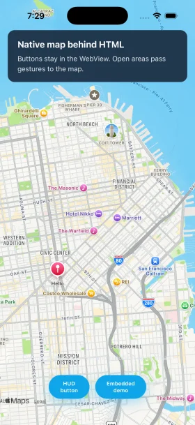

# @capgo/capacitor-native-map

<a href="https://capgo.app/"></a>

<div align="center">
  <h2><a href="https://capgo.app/?ref=plugin_native_map"> ➡️ Get instant updates for your app with Capgo</a></h2>
  <h2><a href="https://capgo.app/consulting/?ref=plugin_native_map"> Missing a feature? We can build the plugin for you</a></h2>
</div>


**One TypeScript API for native maps in Capacitor apps:** Google Maps on Android, Apple MapKit on iOS, and Google Maps JS on the web. Ship markers, camera moves, shapes, clustering, search, and events from a single integration.

<p align="center">
  
</p>

Docs: [Native Map plugin](https://capgo.app/docs/plugins/native-map/) · Tutorial: [capacitor-native-map](https://capgo.app/plugins/capacitor-native-map/)

## Why use it

- **Single API** on iOS, Android, and web (`NativeMap.create`, shared listeners, shared types).
- **Native map performance** on mobile (platform map views, not a WebView map).
- **Custom map UI** with `toBack`: render the native map behind a transparent WebView and build controls in HTML.
- **Capacitor 8** with TypeScript 6 and an example app you can run locally.

## Features

| Area | Highlights |
| --- | --- |
| **Map lifecycle** | Create, destroy, resize, `show` / `hide`, `updateLayout`, scroll sync with Ionic |
| **Background mode** | `toBack` compositing, multi-touch passthrough on transparent HTML (pinch, rotate, tilt, pan) |
| **Camera** | Center, zoom, bearing, tilt, fit bounds, min/max zoom |
| **Markers** | Add/update/remove, drag, selection, callouts, clustering |
| **Overlays** | Polygons, polylines, circles, tile overlays (platform-dependent) |
| **Events** | Map/marker/shape clicks, camera idle/move, clusters, my location |
| **Extras** | Snapshots, autocomplete/places search, geocode/reverse geocode |

## Use cases

- Store locators and field-service maps with live GPS
- Delivery and fleet dashboards with markers and routes
- Event venues, real-estate listings, and travel apps
- Custom-branded map UIs (search bars, filters, bottom sheets) over a native map

## Compatibility

| Platform | Map engine | API key |
| --- | --- | --- |
| **iOS** | Apple MapKit | Not required for the map |
| **Android** | Google Maps SDK | `GOOGLE_MAPS_API_KEY` in the app manifest |
| **Web** | Google Maps JavaScript API | `apiKey` + `config.mapId` on `create` |

Requires **Capacitor 8+**. Plugin major version follows Capacitor (this package is **v8**).

## Install

```bash
npm install @capgo/capacitor-native-map
npx cap sync
```

## iOS (MapKit)

No Google Maps API key is required on iOS. Add location usage strings to `Info.plist` if you enable current location:

```xml
<key>NSLocationWhenInUseUsageDescription</key>
<string>We use your location to show you on the map.</string>
```

Sync the plugin with CocoaPods or Swift Package Manager (both are supported).

## Android (Google Maps)

1. Create a Google Maps SDK for Android key in [Google Cloud Console](https://console.cloud.google.com/).
2. Set the key on the application `meta-data` entry (see `example-app/android/app/src/main/AndroidManifest.xml`):

```xml
<meta-data
    android:name="com.google.android.geo.API_KEY"
    android:value="${GOOGLE_MAPS_API_KEY}" />
```

3. Provide `GOOGLE_MAPS_API_KEY` when building (Gradle placeholder in `example-app/android/app/build.gradle`).

## Usage

### Embedded map

```ts
import { NativeMap } from '@capgo/capacitor-native-map';

const map = await NativeMap.create({
  id: 'main-map',
  element: document.getElementById('map')!,
  apiKey: 'YOUR_GOOGLE_MAPS_API_KEY',
  config: {
    center: { lat: 37.7749, lng: -122.4194 },
    zoom: 12,
  },
});

map.setOnMapClickListener((e) => console.log('click', e.latitude, e.longitude));
```

### Background map (`toBack`) with HTML overlay

```ts
const map = await NativeMap.create({
  id: 'overlay-map',
  toBack: true,
  apiKey: 'YOUR_GOOGLE_MAPS_API_KEY',
  config: {
    center: { lat: 37.7749, lng: -122.4194 },
    zoom: 12,
    x: 0,
    y: 0,
    width: window.innerWidth,
    height: window.innerHeight,
  },
});

await map.updateLayout({ x: 0, y: 0, width: window.innerWidth, height: window.innerHeight });
await map.hide();
await map.show();
```

The [example app](./example-app) opens in **overlay (`toBack`)** mode by default.

## Build your own map UI

Product teams often want a **fully custom map screen** (brand colors, filters, bottom sheets) while keeping native map performance. This plugin supports that pattern:

1. Call `NativeMap.create({ toBack: true, ... })` so MapKit or Google Maps renders **behind** the Capacitor WebView.
2. Make the WebView and page background **transparent** so the map is visible.
3. Build controls in HTML. Use `data-map-overlay` (or interactive elements) on controls that must receive touches; transparent areas pass gestures to the map.

### Transparent app / page CSS

```css
html.native-map-to-back,
body.native-map-to-back {
  background: transparent !important;
}

:root {
  --ion-background-color: transparent !important;
}

.map-overlay-root {
  position: fixed;
  inset: 0;
  pointer-events: none;
}

.map-overlay-root [data-map-overlay] {
  pointer-events: auto;
}
```

### Full HTML overlay example

```html
<div class="map-overlay-root" data-native-map-overlay-root>
  <header class="hud" data-map-overlay>
    <h1>Nearby stores</h1>
    <button type="button" id="recenter">Recenter</button>
  </header>
  <footer class="sheet" data-map-overlay>
    <p>Pinch and pan on open areas to move the map.</p>
  </footer>
</div>
```

```ts
const map = await NativeMap.create({
  id: 'stores-map',
  toBack: true,
  apiKey: GOOGLE_KEY,
  config: {
    center: { lat: 40.7128, lng: -74.006 },
    zoom: 11,
    width: window.innerWidth,
    height: window.innerHeight,
  },
});

document.getElementById('recenter')?.addEventListener('click', () => {
  map.setCamera({ coordinate: { lat: 40.7128, lng: -74.006 }, zoom: 13, animate: true });
});
```

## Example app

```bash
cd example-app
bun install
bun run build
bunx cap sync
```

Set `VITE_GOOGLE_MAPS_API_KEY` in `example-app/.env` for the web dev server. Android native builds use `GOOGLE_MAPS_API_KEY` for the Gradle manifest placeholder (see `example-app/android/app/build.gradle`). iOS uses MapKit without a Google key.

Credits: portions adapted from [katamalabs/capacitor-plugin-apple-maps](https://github.com/katamalabs/capacitor-plugin-apple-maps) and [ionic-team/capacitor-google-maps](https://github.com/ionic-team/capacitor-google-maps) (both MIT).

## API

<docgen-index>
<docgen-api>
<!--Update the source file JSDoc comments and rerun docgen to update the docs below-->

### create(...)

```typescript
create(options: CreateMapArgs) => Promise<void>
```

| Param         | Type                                                    |
| ------------- | ------------------------------------------------------- |
| **`options`** | <code><a href="#createmapargs">CreateMapArgs</a></code> |

--------------------


### enableTouch(...)

```typescript
enableTouch(args: { id: string; }) => Promise<void>
```

| Param      | Type                         |
| ---------- | ---------------------------- |
| **`args`** | <code>{ id: string; }</code> |

--------------------


### disableTouch(...)

```typescript
disableTouch(args: { id: string; }) => Promise<void>
```

| Param      | Type                         |
| ---------- | ---------------------------- |
| **`args`** | <code>{ id: string; }</code> |

--------------------


### addTileOverlay(...)

```typescript
addTileOverlay(args: AddTileOverlayArgs) => Promise<{ id: string; }>
```

| Param      | Type                                                              |
| ---------- | ----------------------------------------------------------------- |
| **`args`** | <code><a href="#addtileoverlayargs">AddTileOverlayArgs</a></code> |

**Returns:** <code>Promise&lt;{ id: string; }&gt;</code>

--------------------


### removeTileOverlay(...)

```typescript
removeTileOverlay(args: RemoveTileOverlayArgs) => Promise<void>
```

| Param      | Type                                                                    |
| ---------- | ----------------------------------------------------------------------- |
| **`args`** | <code><a href="#removetileoverlayargs">RemoveTileOverlayArgs</a></code> |

--------------------


### addMarker(...)

```typescript
addMarker(args: AddMarkerArgs) => Promise<{ id: string; }>
```

| Param      | Type                                                    |
| ---------- | ------------------------------------------------------- |
| **`args`** | <code><a href="#addmarkerargs">AddMarkerArgs</a></code> |

**Returns:** <code>Promise&lt;{ id: string; }&gt;</code>

--------------------


### addMarkers(...)

```typescript
addMarkers(args: AddMarkersArgs) => Promise<{ ids: string[]; }>
```

| Param      | Type                                                      |
| ---------- | --------------------------------------------------------- |
| **`args`** | <code><a href="#addmarkersargs">AddMarkersArgs</a></code> |

**Returns:** <code>Promise&lt;{ ids: string[]; }&gt;</code>

--------------------


### removeMarker(...)

```typescript
removeMarker(args: RemoveMarkerArgs) => Promise<void>
```

| Param      | Type                                                          |
| ---------- | ------------------------------------------------------------- |
| **`args`** | <code><a href="#removemarkerargs">RemoveMarkerArgs</a></code> |

--------------------


### removeMarkers(...)

```typescript
removeMarkers(args: RemoveMarkersArgs) => Promise<void>
```

| Param      | Type                                                            |
| ---------- | --------------------------------------------------------------- |
| **`args`** | <code><a href="#removemarkersargs">RemoveMarkersArgs</a></code> |

--------------------


### addPolygons(...)

```typescript
addPolygons(args: AddPolygonsArgs) => Promise<{ ids: string[]; }>
```

| Param      | Type                                                        |
| ---------- | ----------------------------------------------------------- |
| **`args`** | <code><a href="#addpolygonsargs">AddPolygonsArgs</a></code> |

**Returns:** <code>Promise&lt;{ ids: string[]; }&gt;</code>

--------------------


### removePolygons(...)

```typescript
removePolygons(args: RemovePolygonsArgs) => Promise<void>
```

| Param      | Type                                                              |
| ---------- | ----------------------------------------------------------------- |
| **`args`** | <code><a href="#removepolygonsargs">RemovePolygonsArgs</a></code> |

--------------------


### addCircles(...)

```typescript
addCircles(args: AddCirclesArgs) => Promise<{ ids: string[]; }>
```

| Param      | Type                                                      |
| ---------- | --------------------------------------------------------- |
| **`args`** | <code><a href="#addcirclesargs">AddCirclesArgs</a></code> |

**Returns:** <code>Promise&lt;{ ids: string[]; }&gt;</code>

--------------------


### removeCircles(...)

```typescript
removeCircles(args: RemoveCirclesArgs) => Promise<void>
```

| Param      | Type                                                            |
| ---------- | --------------------------------------------------------------- |
| **`args`** | <code><a href="#removecirclesargs">RemoveCirclesArgs</a></code> |

--------------------


### addPolylines(...)

```typescript
addPolylines(args: AddPolylinesArgs) => Promise<{ ids: string[]; }>
```

| Param      | Type                                                          |
| ---------- | ------------------------------------------------------------- |
| **`args`** | <code><a href="#addpolylinesargs">AddPolylinesArgs</a></code> |

**Returns:** <code>Promise&lt;{ ids: string[]; }&gt;</code>

--------------------


### removePolylines(...)

```typescript
removePolylines(args: RemovePolylinesArgs) => Promise<void>
```

| Param      | Type                                                                |
| ---------- | ------------------------------------------------------------------- |
| **`args`** | <code><a href="#removepolylinesargs">RemovePolylinesArgs</a></code> |

--------------------


### enableClustering(...)

```typescript
enableClustering(args: EnableClusteringArgs) => Promise<void>
```

| Param      | Type                                                                  |
| ---------- | --------------------------------------------------------------------- |
| **`args`** | <code><a href="#enableclusteringargs">EnableClusteringArgs</a></code> |

--------------------


### disableClustering(...)

```typescript
disableClustering(args: { id: string; }) => Promise<void>
```

| Param      | Type                         |
| ---------- | ---------------------------- |
| **`args`** | <code>{ id: string; }</code> |

--------------------


### destroy(...)

```typescript
destroy(args: DestroyMapArgs) => Promise<void>
```

| Param      | Type                                                      |
| ---------- | --------------------------------------------------------- |
| **`args`** | <code><a href="#destroymapargs">DestroyMapArgs</a></code> |

--------------------


### setCamera(...)

```typescript
setCamera(args: CameraArgs) => Promise<void>
```

| Param      | Type                                              |
| ---------- | ------------------------------------------------- |
| **`args`** | <code><a href="#cameraargs">CameraArgs</a></code> |

--------------------


### getMapType(...)

```typescript
getMapType(args: { id: string; }) => Promise<{ type: string; }>
```

| Param      | Type                         |
| ---------- | ---------------------------- |
| **`args`** | <code>{ id: string; }</code> |

**Returns:** <code>Promise&lt;{ type: string; }&gt;</code>

--------------------


### setMapType(...)

```typescript
setMapType(args: MapTypeArgs) => Promise<void>
```

| Param      | Type                                                |
| ---------- | --------------------------------------------------- |
| **`args`** | <code><a href="#maptypeargs">MapTypeArgs</a></code> |

--------------------


### enableIndoorMaps(...)

```typescript
enableIndoorMaps(args: IndoorMapArgs) => Promise<void>
```

| Param      | Type                                                    |
| ---------- | ------------------------------------------------------- |
| **`args`** | <code><a href="#indoormapargs">IndoorMapArgs</a></code> |

--------------------


### enableTrafficLayer(...)

```typescript
enableTrafficLayer(args: TrafficLayerArgs) => Promise<void>
```

| Param      | Type                                                          |
| ---------- | ------------------------------------------------------------- |
| **`args`** | <code><a href="#trafficlayerargs">TrafficLayerArgs</a></code> |

--------------------


### enableAccessibilityElements(...)

```typescript
enableAccessibilityElements(args: AccElementsArgs) => Promise<void>
```

| Param      | Type                                                        |
| ---------- | ----------------------------------------------------------- |
| **`args`** | <code><a href="#accelementsargs">AccElementsArgs</a></code> |

--------------------


### enableCurrentLocation(...)

```typescript
enableCurrentLocation(args: CurrentLocArgs) => Promise<void>
```

| Param      | Type                                                      |
| ---------- | --------------------------------------------------------- |
| **`args`** | <code><a href="#currentlocargs">CurrentLocArgs</a></code> |

--------------------


### setPadding(...)

```typescript
setPadding(args: PaddingArgs) => Promise<void>
```

| Param      | Type                                                |
| ---------- | --------------------------------------------------- |
| **`args`** | <code><a href="#paddingargs">PaddingArgs</a></code> |

--------------------


### onScroll(...)

```typescript
onScroll(args: MapBoundsArgs) => Promise<void>
```

| Param      | Type                                                    |
| ---------- | ------------------------------------------------------- |
| **`args`** | <code><a href="#mapboundsargs">MapBoundsArgs</a></code> |

--------------------


### onResize(...)

```typescript
onResize(args: MapBoundsArgs) => Promise<void>
```

| Param      | Type                                                    |
| ---------- | ------------------------------------------------------- |
| **`args`** | <code><a href="#mapboundsargs">MapBoundsArgs</a></code> |

--------------------


### onDisplay(...)

```typescript
onDisplay(args: MapBoundsArgs) => Promise<void>
```

| Param      | Type                                                    |
| ---------- | ------------------------------------------------------- |
| **`args`** | <code><a href="#mapboundsargs">MapBoundsArgs</a></code> |

--------------------


### dispatchMapEvent(...)

```typescript
dispatchMapEvent(args: { id: string; focus: boolean; }) => Promise<void>
```

| Param      | Type                                         |
| ---------- | -------------------------------------------- |
| **`args`** | <code>{ id: string; focus: boolean; }</code> |

--------------------


### getMapBounds(...)

```typescript
getMapBounds(args: { id: string; }) => Promise<LatLngBounds>
```

| Param      | Type                         |
| ---------- | ---------------------------- |
| **`args`** | <code>{ id: string; }</code> |

**Returns:** <code>Promise&lt;LatLngBounds&gt;</code>

--------------------


### fitBounds(...)

```typescript
fitBounds(args: FitBoundsArgs) => Promise<void>
```

| Param      | Type                                                    |
| ---------- | ------------------------------------------------------- |
| **`args`** | <code><a href="#fitboundsargs">FitBoundsArgs</a></code> |

--------------------


### mapBoundsContains(...)

```typescript
mapBoundsContains(args: MapBoundsContainsArgs) => Promise<{ contains: boolean; }>
```

| Param      | Type                                                                    |
| ---------- | ----------------------------------------------------------------------- |
| **`args`** | <code><a href="#mapboundscontainsargs">MapBoundsContainsArgs</a></code> |

**Returns:** <code>Promise&lt;{ contains: boolean; }&gt;</code>

--------------------


### mapBoundsExtend(...)

```typescript
mapBoundsExtend(args: MapBoundsExtendArgs) => Promise<{ bounds: LatLngBounds; }>
```

| Param      | Type                                                                    |
| ---------- | ----------------------------------------------------------------------- |
| **`args`** | <code><a href="#mapboundscontainsargs">MapBoundsContainsArgs</a></code> |

**Returns:** <code>Promise&lt;{ bounds: LatLngBounds; }&gt;</code>

--------------------


### updateLayout(...)

```typescript
updateLayout(args: MapLayoutArgs) => Promise<void>
```

Updates the native map position and size without recreating the map.
Useful with `toBack` mode to resize or reposition the map layer.

| Param      | Type                                                    |
| ---------- | ------------------------------------------------------- |
| **`args`** | <code><a href="#maplayoutargs">MapLayoutArgs</a></code> |

--------------------


### show(...)

```typescript
show(args: { id: string; }) => Promise<void>
```

Shows a map that was hidden with {@link NativeMapPlugin.hide}.

| Param      | Type                         |
| ---------- | ---------------------------- |
| **`args`** | <code>{ id: string; }</code> |

--------------------


### hide(...)

```typescript
hide(args: { id: string; }) => Promise<void>
```

Hides the native map view while keeping the instance alive.

| Param      | Type                         |
| ---------- | ---------------------------- |
| **`args`** | <code>{ id: string; }</code> |

--------------------


### Interfaces


#### CreateMapArgs

An interface containing the options used when creating a map.

| Prop              | Type                                                        | Description                                                                                                                                                                                                                                                                                                                                                                                                                                                                                                         | Default            |
| ----------------- | ----------------------------------------------------------- | ------------------------------------------------------------------------------------------------------------------------------------------------------------------------------------------------------------------------------------------------------------------------------------------------------------------------------------------------------------------------------------------------------------------------------------------------------------------------------------------------------------------- | ------------------ |
| **`id`**          | <code>string</code>                                         | A unique identifier for the map instance.                                                                                                                                                                                                                                                                                                                                                                                                                                                                           |                    |
| **`apiKey`**      | <code>string</code>                                         | Google Maps API key. Required on web. On Android, also set `com.google.android.geo.API_KEY` in the app manifest. Not used on iOS (MapKit).                                                                                                                                                                                                                                                                                                                                                                          |                    |
| **`config`**      | <code><a href="#nativemapconfig">NativeMapConfig</a></code> | The initial configuration settings for the map.                                                                                                                                                                                                                                                                                                                                                                                                                                                                     |                    |
| **`element`**     | <code>HTMLElement</code>                                    | The DOM element that determines size and positioning for embedded maps. Optional when `toBack` is `true` (defaults to `document.body`).                                                                                                                                                                                                                                                                                                                                                                             |                    |
| **`forceCreate`** | <code>boolean</code>                                        | Destroy and re-create the map instance if a map with the supplied id already exists                                                                                                                                                                                                                                                                                                                                                                                                                                 | <code>false</code> |
| **`region`**      | <code>string</code>                                         | The region parameter alters your application to serve different map tiles or bias the application (such as biasing geocoding results towards the region). Only available for web.                                                                                                                                                                                                                                                                                                                                   |                    |
| **`language`**    | <code>string</code>                                         | The language parameter affects the names of controls, copyright notices, driving directions, and control labels, as well as the responses to service requests. Only available for web.                                                                                                                                                                                                                                                                                                                              |                    |
| **`toBack`**      | <code>boolean</code>                                        | When `true`, renders the native map behind a transparent WebView so your HTML UI can sit on top. Touches on transparent web areas pass through to the map, including multi-touch gestures (pinch zoom, rotate, two-finger tilt, pan). Touches on interactive HTML elements stay in the WebView. On native platforms, set `config.x`, `config.y`, `config.width`, and `config.height` for position and size (defaults to the viewport when omitted). Use {@link NativeMap.updateLayout} to change layout at runtime. | <code>false</code> |


#### NativeMapConfig

For web, all the javascript Google Maps options are available as
NativeMapConfig extends google.maps.MapOptions.
For iOS and Android only the config options declared on <a href="#nativemapconfig">NativeMapConfig</a> are available.

| Prop                   | Type                                      | Description                                                                                                                                                                                                                                                                                                                                               | Default            | Since |
| ---------------------- | ----------------------------------------- | --------------------------------------------------------------------------------------------------------------------------------------------------------------------------------------------------------------------------------------------------------------------------------------------------------------------------------------------------------- | ------------------ | ----- |
| **`width`**            | <code>number</code>                       | Override width for native map.                                                                                                                                                                                                                                                                                                                            |                    |       |
| **`height`**           | <code>number</code>                       | Override height for native map.                                                                                                                                                                                                                                                                                                                           |                    |       |
| **`x`**                | <code>number</code>                       | Override absolute x coordinate position for native map.                                                                                                                                                                                                                                                                                                   |                    |       |
| **`y`**                | <code>number</code>                       | Override absolute y coordinate position for native map.                                                                                                                                                                                                                                                                                                   |                    |       |
| **`center`**           | <code><a href="#latlng">LatLng</a></code> | Default location on the Earth towards which the camera points.                                                                                                                                                                                                                                                                                            |                    |       |
| **`zoom`**             | <code>number</code>                       | Sets the zoom of the map.                                                                                                                                                                                                                                                                                                                                 |                    |       |
| **`androidLiteMode`**  | <code>boolean</code>                      | Enables image-based lite mode on Android.                                                                                                                                                                                                                                                                                                                 | <code>false</code> |       |
| **`devicePixelRatio`** | <code>number</code>                       | Override pixel ratio for native map.                                                                                                                                                                                                                                                                                                                      |                    |       |
| **`styles`**           | <code>MapTypeStyle[] \| null</code>       | Styles to apply to each of the default map types. Note that for satellite, hybrid and terrain modes, these styles will only apply to labels and geometry.                                                                                                                                                                                                 |                    | 4.3.0 |
| **`mapId`**            | <code>string</code>                       | A map id associated with a specific map style or feature. [Use Map IDs](https://developers.google.com/maps/documentation/get-map-id) Only for Web.                                                                                                                                                                                                        |                    | 5.4.0 |
| **`androidMapId`**     | <code>string</code>                       | A map id associated with a specific map style or feature. [Use Map IDs](https://developers.google.com/maps/documentation/get-map-id) Only for Android.                                                                                                                                                                                                    |                    | 5.4.0 |
| **`iOSMapId`**         | <code>string</code>                       | A map id associated with a specific map style or feature. [Use Map IDs](https://developers.google.com/maps/documentation/get-map-id) Only for iOS.                                                                                                                                                                                                        |                    | 5.4.0 |
| **`maxZoom`**          | <code>number \| null</code>               | The maximum zoom level which will be displayed on the map. If omitted, or set to &lt;code&gt;null&lt;/code&gt;, the maximum zoom from the current map type is used instead. Valid zoom values are numbers from zero up to the supported &lt;a href="https://developers.google.com/maps/documentation/javascript/maxzoom"&gt;maximum zoom level&lt;/a&gt;. |                    |       |
| **`minZoom`**          | <code>number \| null</code>               | The minimum zoom level which will be displayed on the map. If omitted, or set to &lt;code&gt;null&lt;/code&gt;, the minimum zoom from the current map type is used instead. Valid zoom values are numbers from zero up to the supported &lt;a href="https://developers.google.com/maps/documentation/javascript/maxzoom"&gt;maximum zoom level&lt;/a&gt;. |                    |       |
| **`mapTypeId`**        | <code>string \| null</code>               | The initial Map mapTypeId. Defaults to &lt;code&gt;ROADMAP&lt;/code&gt;.                                                                                                                                                                                                                                                                                  |                    |       |
| **`heading`**          | <code>number \| null</code>               | The heading for aerial imagery in degrees measured clockwise from cardinal direction North. Headings are snapped to the nearest available angle for which imagery is available.                                                                                                                                                                           |                    |       |
| **`restriction`**      | <code>MapRestriction \| null</code>       | Defines a boundary that restricts the area of the map accessible to users. When set, a user can only pan and zoom while the camera view stays inside the limits of the boundary.                                                                                                                                                                          |                    |       |


#### LatLng

An interface representing a pair of latitude and longitude coordinates.

| Prop      | Type                | Description                                                               |
| --------- | ------------------- | ------------------------------------------------------------------------- |
| **`lat`** | <code>number</code> | Coordinate latitude, in degrees. This value is in the range [-90, 90].    |
| **`lng`** | <code>number</code> | Coordinate longitude, in degrees. This value is in the range [-180, 180]. |


#### AddTileOverlayArgs

| Prop              | Type                                                |
| ----------------- | --------------------------------------------------- |
| **`id`**          | <code>string</code>                                 |
| **`tileOverlay`** | <code><a href="#tileoverlay">TileOverlay</a></code> |


#### TileOverlay

A tile overlay is an image placed on top of your map at a specific zoom level. Supported on Android and web only.

| Prop          | Type                 | Description                                                                                                                                                   | Default                |
| ------------- | -------------------- | ------------------------------------------------------------------------------------------------------------------------------------------------------------- | ---------------------- |
| **`url`**     | <code>string</code>  | A string representing the tile url. Should contain `{x}`, `{y}` and `{z}` so they can be replaced with actual values for x, y and zoom. Android and web only. |                        |
| **`opacity`** | <code>number</code>  | The opacity of the tile overlay, between 0 (completely transparent) and 1 inclusive. Available on iOS, Android and Web                                        | <code>undefined</code> |
| **`visible`** | <code>boolean</code> | Controls whether this tile overlay should be visible. Available only on Android                                                                               | <code>undefined</code> |
| **`zIndex`**  | <code>number</code>  | The zIndex of the tile overlay. Available on iOS and Android                                                                                                  | <code>undefined</code> |


#### RemoveTileOverlayArgs

| Prop                | Type                |
| ------------------- | ------------------- |
| **`id`**            | <code>string</code> |
| **`tileOverlayId`** | <code>string</code> |


#### AddMarkerArgs

| Prop         | Type                                      |
| ------------ | ----------------------------------------- |
| **`id`**     | <code>string</code>                       |
| **`marker`** | <code><a href="#marker">Marker</a></code> |


#### Marker

A marker is an icon placed at a particular point on the map's surface.

| Prop             | Type                                                         | Description                                                                                                                                                                               | Default            | Since |
| ---------------- | ------------------------------------------------------------ | ----------------------------------------------------------------------------------------------------------------------------------------------------------------------------------------- | ------------------ | ----- |
| **`coordinate`** | <code><a href="#latlng">LatLng</a></code>                    | <a href="#marker">Marker</a> position                                                                                                                                                     |                    |       |
| **`opacity`**    | <code>number</code>                                          | Sets the opacity of the marker, between 0 (completely transparent) and 1 inclusive.                                                                                                       | <code>1</code>     |       |
| **`title`**      | <code>string</code>                                          | Title, a short description of the overlay.                                                                                                                                                |                    |       |
| **`snippet`**    | <code>string</code>                                          | Snippet text, shown beneath the title in the info window when selected.                                                                                                                   |                    |       |
| **`isFlat`**     | <code>boolean</code>                                         | Controls whether this marker should be flat against the Earth's surface or a billboard facing the camera.                                                                                 | <code>false</code> |       |
| **`iconUrl`**    | <code>string</code>                                          | Path to a marker icon to render. It can be relative to the web app public directory, or a https url of a remote marker icon. **SVGs are not supported on native platforms.**              |                    | 4.2.0 |
| **`iconSize`**   | <code><a href="#size">Size</a></code>                        | Controls the scaled size of the marker image set in `iconUrl`.                                                                                                                            |                    | 4.2.0 |
| **`iconOrigin`** | <code><a href="#point">Point</a></code>                      | The position of the image within a sprite, if any. By default, the origin is located at the top left corner of the image .                                                                |                    | 4.2.0 |
| **`iconAnchor`** | <code><a href="#point">Point</a></code>                      | The position at which to anchor an image in correspondence to the location of the marker on the map. By default, the anchor is located along the center point of the bottom of the image. |                    | 4.2.0 |
| **`tintColor`**  | <code>{ r: number; g: number; b: number; a: number; }</code> | Customizes the color of the default marker image. Each value must be between 0 and 255. Only for iOS and Android.                                                                         |                    | 4.2.0 |
| **`draggable`**  | <code>boolean</code>                                         | Controls whether this marker can be dragged interactively                                                                                                                                 | <code>false</code> |       |
| **`zIndex`**     | <code>number</code>                                          | Specifies the stack order of this marker, relative to other markers on the map. A marker with a high z-index is drawn on top of markers with lower z-indexes                              | <code>0</code>     |       |


#### Size

Width and height in pixels.

| Prop         | Type                |
| ------------ | ------------------- |
| **`width`**  | <code>number</code> |
| **`height`** | <code>number</code> |


#### Point

<a href="#point">Point</a> geometry object.
https://tools.ietf.org/html/rfc7946#section-3.1.2

| Prop              | Type                                          | Description                           |
| ----------------- | --------------------------------------------- | ------------------------------------- |
| **`type`**        | <code>'<a href="#point">Point</a>'</code>     | Specifies the type of GeoJSON object. |
| **`coordinates`** | <code><a href="#position">Position</a></code> |                                       |


#### Position

| Prop         | Type                | Description |
| ------------ | ------------------- | ----------- |
| **`line`**   | <code>number</code> | &gt;= 1     |
| **`column`** | <code>number</code> | &gt;= 0     |


#### AddMarkersArgs

| Prop          | Type                  |
| ------------- | --------------------- |
| **`id`**      | <code>string</code>   |
| **`markers`** | <code>Marker[]</code> |


#### RemoveMarkerArgs

| Prop           | Type                |
| -------------- | ------------------- |
| **`id`**       | <code>string</code> |
| **`markerId`** | <code>string</code> |


#### RemoveMarkersArgs

| Prop            | Type                  |
| --------------- | --------------------- |
| **`id`**        | <code>string</code>   |
| **`markerIds`** | <code>string[]</code> |


#### AddPolygonsArgs

| Prop           | Type                   |
| -------------- | ---------------------- |
| **`id`**       | <code>string</code>    |
| **`polygons`** | <code>Polygon[]</code> |


#### Polygon

<a href="#polygon">Polygon</a> geometry object.
https://tools.ietf.org/html/rfc7946#section-3.1.6

| Prop              | Type                                          | Description                           |
| ----------------- | --------------------------------------------- | ------------------------------------- |
| **`type`**        | <code>'<a href="#polygon">Polygon</a>'</code> | Specifies the type of GeoJSON object. |
| **`coordinates`** | <code>Position[][]</code>                     |                                       |


#### RemovePolygonsArgs

| Prop             | Type                  |
| ---------------- | --------------------- |
| **`id`**         | <code>string</code>   |
| **`polygonIds`** | <code>string[]</code> |


#### AddCirclesArgs

| Prop          | Type                  |
| ------------- | --------------------- |
| **`id`**      | <code>string</code>   |
| **`circles`** | <code>Circle[]</code> |


#### Circle

For web, all the javascript <a href="#circle">Circle</a> options are available as
Circle extends google.maps.CircleOptions.
For iOS and Android only the config options declared on <a href="#circle">Circle</a> are available.

| Prop               | Type                 | Description                                                                                                                                                                            |
| ------------------ | -------------------- | -------------------------------------------------------------------------------------------------------------------------------------------------------------------------------------- |
| **`fillColor`**    | <code>string</code>  | The fill color. All CSS3 colors are supported except for extended named colors.                                                                                                        |
| **`fillOpacity`**  | <code>number</code>  | The fill opacity between 0.0 and 1.0.                                                                                                                                                  |
| **`strokeColor`**  | <code>string</code>  | The stroke color. All CSS3 colors are supported except for extended named colors.                                                                                                      |
| **`strokeWeight`** | <code>number</code>  | The stroke width in pixels.                                                                                                                                                            |
| **`geodesic`**     | <code>boolean</code> |                                                                                                                                                                                        |
| **`clickable`**    | <code>boolean</code> | Indicates whether this &lt;code&gt;<a href="#circle">Circle</a>&lt;/code&gt; handles mouse events.                                                                                     |
| **`title`**        | <code>string</code>  | Title, a short description of the overlay. Some overlays, such as markers, will display the title on the map. The title is also the default accessibility text. Only available on iOS. |
| **`tag`**          | <code>string</code>  |                                                                                                                                                                                        |


#### RemoveCirclesArgs

| Prop            | Type                  |
| --------------- | --------------------- |
| **`id`**        | <code>string</code>   |
| **`circleIds`** | <code>string[]</code> |


#### AddPolylinesArgs

| Prop            | Type                    |
| --------------- | ----------------------- |
| **`id`**        | <code>string</code>     |
| **`polylines`** | <code>Polyline[]</code> |


#### Polyline

For web, all the javascript <a href="#polyline">Polyline</a> options are available as
Polyline extends google.maps.PolylineOptions.
For iOS and Android only the config options declared on <a href="#polyline">Polyline</a> are available.

| Prop                | Type                     | Description                                                                                                                                                                                                                                                                                                                                                                                    |
| ------------------- | ------------------------ | ---------------------------------------------------------------------------------------------------------------------------------------------------------------------------------------------------------------------------------------------------------------------------------------------------------------------------------------------------------------------------------------------- |
| **`strokeColor`**   | <code>string</code>      | The stroke color. All CSS3 colors are supported except for extended named colors.                                                                                                                                                                                                                                                                                                              |
| **`strokeOpacity`** | <code>number</code>      | The stroke opacity between 0.0 and 1.0.                                                                                                                                                                                                                                                                                                                                                        |
| **`strokeWeight`**  | <code>number</code>      | The stroke width in pixels.                                                                                                                                                                                                                                                                                                                                                                    |
| **`geodesic`**      | <code>boolean</code>     | When &lt;code&gt;true&lt;/code&gt;, edges of the polygon are interpreted as geodesic and will follow the curvature of the Earth. When &lt;code&gt;false&lt;/code&gt;, edges of the polygon are rendered as straight lines in screen space. Note that the shape of a geodesic polygon may appear to change when dragged, as the dimensions are maintained relative to the surface of the earth. |
| **`clickable`**     | <code>boolean</code>     | Indicates whether this &lt;code&gt;<a href="#polyline">Polyline</a>&lt;/code&gt; handles mouse events.                                                                                                                                                                                                                                                                                         |
| **`tag`**           | <code>string</code>      |                                                                                                                                                                                                                                                                                                                                                                                                |
| **`styleSpans`**    | <code>StyleSpan[]</code> | Used to specify the color of one or more segments of a polyline. The styleSpans property is an array of <a href="#stylespan">StyleSpan</a> objects. Setting the spans property is the preferred way to change the color of a polyline. Only on iOS and Android.                                                                                                                                |


#### StyleSpan

Describes the style for some region of a polyline.

| Prop           | Type                | Description                                                                       |
| -------------- | ------------------- | --------------------------------------------------------------------------------- |
| **`color`**    | <code>string</code> | The stroke color. All CSS3 colors are supported except for extended named colors. |
| **`segments`** | <code>number</code> | The length of this span in number of segments.                                    |


#### RemovePolylinesArgs

| Prop              | Type                  |
| ----------------- | --------------------- |
| **`id`**          | <code>string</code>   |
| **`polylineIds`** | <code>string[]</code> |


#### EnableClusteringArgs

| Prop                 | Type                |
| -------------------- | ------------------- |
| **`id`**             | <code>string</code> |
| **`minClusterSize`** | <code>number</code> |


#### DestroyMapArgs

| Prop     | Type                |
| -------- | ------------------- |
| **`id`** | <code>string</code> |


#### CameraArgs

| Prop         | Type                                                  |
| ------------ | ----------------------------------------------------- |
| **`id`**     | <code>string</code>                                   |
| **`config`** | <code><a href="#cameraconfig">CameraConfig</a></code> |


#### CameraConfig

Configuration properties for a Google Map Camera

| Prop                    | Type                                      | Description                                                                                                            | Default            |
| ----------------------- | ----------------------------------------- | ---------------------------------------------------------------------------------------------------------------------- | ------------------ |
| **`coordinate`**        | <code><a href="#latlng">LatLng</a></code> | Location on the Earth towards which the camera points.                                                                 |                    |
| **`zoom`**              | <code>number</code>                       | Sets the zoom of the map.                                                                                              |                    |
| **`bearing`**           | <code>number</code>                       | Bearing of the camera, in degrees clockwise from true north.                                                           | <code>0</code>     |
| **`angle`**             | <code>number</code>                       | The angle, in degrees, of the camera from the nadir (directly facing the Earth). The only allowed values are 0 and 45. | <code>0</code>     |
| **`animate`**           | <code>boolean</code>                      | Animate the transition to the new Camera properties.                                                                   | <code>false</code> |
| **`animationDuration`** | <code>number</code>                       | This configuration option is not being used.                                                                           |                    |


#### MapTypeArgs

| Prop          | Type                                        |
| ------------- | ------------------------------------------- |
| **`id`**      | <code>string</code>                         |
| **`mapType`** | <code><a href="#maptype">MapType</a></code> |


#### IndoorMapArgs

| Prop          | Type                 |
| ------------- | -------------------- |
| **`id`**      | <code>string</code>  |
| **`enabled`** | <code>boolean</code> |


#### TrafficLayerArgs

| Prop          | Type                 |
| ------------- | -------------------- |
| **`id`**      | <code>string</code>  |
| **`enabled`** | <code>boolean</code> |


#### AccElementsArgs

| Prop          | Type                 |
| ------------- | -------------------- |
| **`id`**      | <code>string</code>  |
| **`enabled`** | <code>boolean</code> |


#### CurrentLocArgs

| Prop          | Type                 |
| ------------- | -------------------- |
| **`id`**      | <code>string</code>  |
| **`enabled`** | <code>boolean</code> |


#### PaddingArgs

| Prop          | Type                                              |
| ------------- | ------------------------------------------------- |
| **`id`**      | <code>string</code>                               |
| **`padding`** | <code><a href="#mappadding">MapPadding</a></code> |


#### MapPadding

Controls for setting padding on the 'visible' region of the view.

| Prop         | Type                |
| ------------ | ------------------- |
| **`top`**    | <code>number</code> |
| **`left`**   | <code>number</code> |
| **`right`**  | <code>number</code> |
| **`bottom`** | <code>number</code> |


#### MapBoundsArgs

| Prop            | Type                                                                  |
| --------------- | --------------------------------------------------------------------- |
| **`id`**        | <code>string</code>                                                   |
| **`mapBounds`** | <code>{ x: number; y: number; width: number; height: number; }</code> |


#### FitBoundsArgs

| Prop          | Type                      |
| ------------- | ------------------------- |
| **`id`**      | <code>string</code>       |
| **`bounds`**  | <code>LatLngBounds</code> |
| **`padding`** | <code>number</code>       |


#### MapBoundsContainsArgs

| Prop         | Type                                      |
| ------------ | ----------------------------------------- |
| **`bounds`** | <code>LatLngBounds</code>                 |
| **`point`**  | <code><a href="#latlng">LatLng</a></code> |


#### MapLayoutArgs

Layout rectangle for {@link NativeMapPlugin.updateLayout}, in CSS pixels relative to the WebView.

| Prop         | Type                | Description                                                |
| ------------ | ------------------- | ---------------------------------------------------------- |
| **`id`**     | <code>string</code> | Map instance id returned from {@link NativeMap.create}.    |
| **`x`**      | <code>number</code> | Distance from the left edge of the WebView, in CSS pixels. |
| **`y`**      | <code>number</code> | Distance from the top edge of the WebView, in CSS pixels.  |
| **`width`**  | <code>number</code> | Map width in CSS pixels.                                   |
| **`height`** | <code>number</code> | Map height in CSS pixels.                                  |


### Type Aliases


#### Position

A <a href="#position">Position</a> is an array of coordinates.
https://tools.ietf.org/html/rfc7946#section-3.1.1
Array should contain between two and three elements.
The previous GeoJSON specification allowed more elements (e.g., which could be used to represent M values),
but the current specification only allows X, Y, and (optionally) Z to be defined.

Note: the type will not be narrowed down to `[number, number] | [number, number, number]` due to
marginal benefits and the large impact of breaking change.

See previous discussions on the type narrowing:
- {@link https://github.com/DefinitelyTyped/DefinitelyTyped/pull/21590|Nov 2017}
- {@link https://github.com/DefinitelyTyped/DefinitelyTyped/discussions/67773|Dec 2023}
- {@link https://github.com/DefinitelyTyped/DefinitelyTyped/discussions/71441| Dec 2024}

One can use a
{@link https://www.typescriptlang.org/docs/handbook/2/narrowing.html#using-type-predicates|user-defined type guard that returns a type predicate}
to determine if a position is a 2D or 3D position.

<code>number[]</code>


#### Marker

Supports markers of either "legacy" or "advanced" types.

<code>google.maps.<a href="#marker">Marker</a> | google.maps.marker.AdvancedMarkerElement</code>


#### MapBoundsExtendArgs

<code><a href="#mapboundscontainsargs">MapBoundsContainsArgs</a></code>


### Enums


#### MapType

| Members         | Value                    | Description                              |
| --------------- | ------------------------ | ---------------------------------------- |
| **`Normal`**    | <code>'Normal'</code>    | Basic map.                               |
| **`Hybrid`**    | <code>'Hybrid'</code>    | Satellite imagery with roads and labels. |
| **`Satellite`** | <code>'Satellite'</code> | Satellite imagery with no labels.        |
| **`Terrain`**   | <code>'Terrain'</code>   | Topographic data.                        |
| **`None`**      | <code>'None'</code>      | No base map tiles.                       |

</docgen-api>
